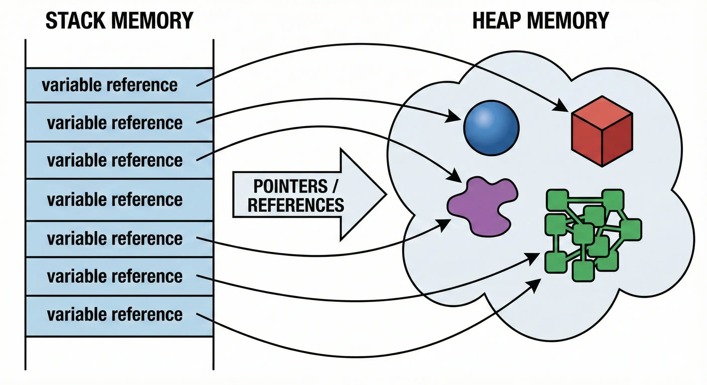

# Introduction to Data Structures

## Fundamental Concepts

  A data structure is a specialized format for organizing, processing, retrieving, and storing data so that it can be used efficiently.

## Memory Management

  In Python, although memory is managed automatically, it is vital to understand two core areas where data is stored during execution:

<ul>
  <li><b>The Stack:</b> Responsible for static memory allocation and managing function calls.</li>
  <li><b>The Heap:</b> Responsible for dynamic memory allocation and object storage.</li>
</ul>

  

<table width="100%">
  <thead>
    <tr>
      <th align="left">Zone in Memory</th>
      <th align="left">Features</th>
      <th align="left">Main Usage</th>
    </tr>
  </thead>
  <tbody>
    <tr>
      <td><b>Stack</b> (Pila)</td>
      <td>Static memory allocation, fast access (LIFO), limited size.</td>
      <td>Store local variables, function calls, recursion and <b>references</b>.</td>
    </tr>
    <tr>
      <td><b>Heap</b> (Montículo)</td>
      <td>Dynamic memory allocation, flexible size, managed by Garbage Collector.</td>
      <td>Store <b>objects</b> (Lists, Classes, Instances, etc.).</td>
    </tr>
  </tbody>
</table>

## Clasification of Data Structures

  Data structures can be classified into two main categories: static and dynamic, and linear and non-linear.

<ul>
  <li><b>Static vs Dynamic:</b> Fixed size at compile vs Variable size at runtime. </li>
  <li><b>Linear vs Non-Linear:</b> Sequence (1:1) vs Hierarchy/Network (1:N).</li>
</ul>

## Big O Notation

  Big O Notation is a mathematical notation that describes the time complexity of an algorithm. We measure performance based on the size of the input.

<ul>
  <li><b>O(1)</b>: Constant time (e.g. accessing `arr[5]`).</li>
  <li><b>O(log n)</b>: Logarithmic time (e.g. binary search).</li>
  <li><b>O(n)</b>: Linear time (e.g. traversing a list).</li>
  <li><b>O(n log n)</b>: Linearithmic time (e.g. merge sort).</li>
  <li><b>O(n²)</b>: Quadratic time (e.g. nested loops).</li>
</ul>

  

