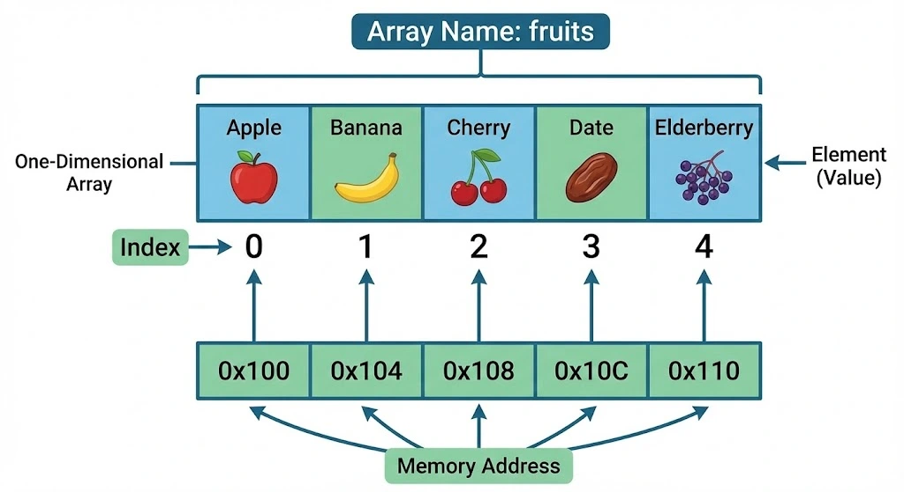

# One-Dimensional Arrays

  A <b>one-dimensional array</b> is a linear data structure that consists of a finite collection of elements of the same type, stored in <b>contiguous memory positions</b>. This contiguity allows for efficient mathematical calculation of any element's address using its index.

  

## Key Characteristics

<ul>
  <li><b>Homogeneity:</b> All elements must be of the same data type.</li>
  <li><b>Fixed Size:</b> The size of the array is defined at the time of creation and cannot be changed (Static behavior).</li>
  <li><b>Contiguity:</b> Memory is allocated in a single block, ensuring that elements are adjacent to each other.</li>
  <li><b>Random Access:</b> Any element can be accessed directly if its index is known.</li>
</ul>

## Operations and Big O Notation

<table width="100%">
  <thead>
    <tr>
      <th align="left">Operation</th>
      <th align="left">Complexity</th>
      <th align="left">Explanation</th>
    </tr>
  </thead>
  <tbody>
    <tr>
      <td><b>Access</b></td>
      <td>O(1)</td>
      <td>Direct access via index (mathematical calculation of address)</td>
    </tr>
    <tr>
      <td><b>Search</b></td>
      <td>O(n)</td>
      <td>Linear search: in the worst case, we must check every element.</td>
    </tr>
     <tr>
      <td><b>Insert</b></td>
      <td>O(n)</td>
      <td>Requires shifting elements to the right to maintain order and contiguity.</td>
    </tr>
     <tr>
      <td><b>Delete</b></td>
      <td>O(n)</td>
      <td>Requires shifting elements to the left to fill the gap and avoid "holes".</td>
    </tr>
  </tbody>
</table>

## Advantages and Disadvantages

<ul>
  <li><b>Advantages:</b> Extremely fast access times and minimal memory overhead (no pointers needed).</li>
  <li><b>Disadvantages:</b> Fixed size can lead to memory waste (if too large) or overflow (if too small), and insertions/deletions are expensive.</li>
</ul>