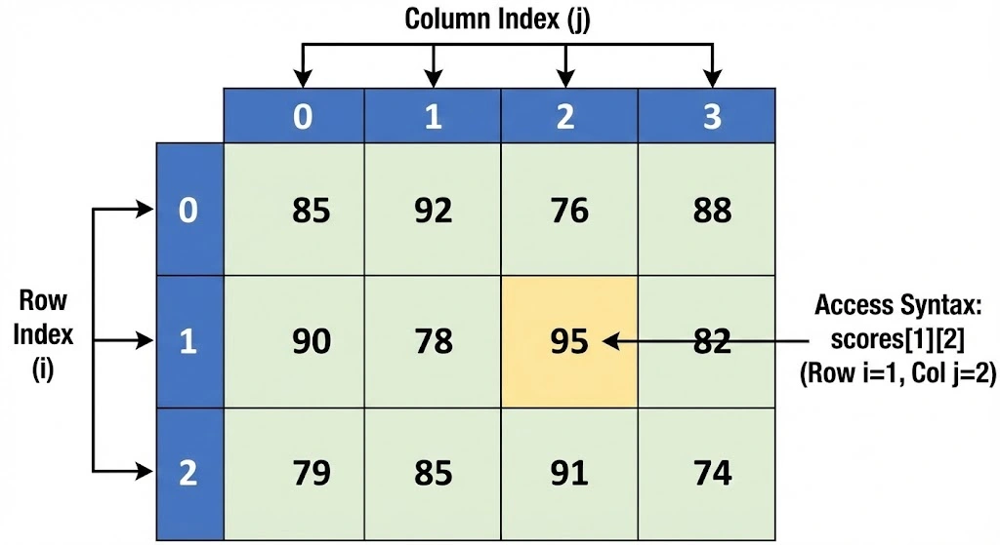

# Two-Dimensional Arrays

A <b>two-dimensional array</b> is a static data structure (in its classic definition) organized in <b>rows (rows)</b> and <b>columns (cols)</b>. It is conceptualized as a table or grid where each element has a unique position defined by two indices <code>[i][j]</code>.

  

## 1. Definition and Access

While a linear array is traversed with a single loop, a matrix generally requires <b>nested loops</b>, which impacts the temporal complexity.

* **Fila (`i`)**: Índice vertical (0 a $N-1$).
* **Columna (`j`)**: Índice horizontal (0 a $M-1$).
* **Acceso**: `matriz[i][j]` es una operación $O(1)$.

## 2. Square Matrices and Special Types

A matrix is square when the number of rows is equal to the number of columns. In this course, we focus on the following variants:

<table width="100%">
  <thead>
    <tr>
      <th>Tipo</th>
      <th>Condición Lógica</th>
      <th>Descripción Gráfica</th>
    </tr>
  </thead>
  <tbody>
    <tr>
      <td><b>Triangular Superior</b></td>
      <td><code>matriz[i][j] == 0</code> si <code>i &gt; j</code></td>
      <td>Solo tiene valores en la diagonal y arriba de ella.</td>
    </tr>
    <tr>
      <td><b>Triangular Inferior</b></td>
      <td><code>matriz[i][j] == 0</code> si <code>i &lt; j</code></td>
      <td>Solo tiene valores en la diagonal y debajo de ella.</td>
    </tr>
    <tr>
      <td><b>Simétrica</b></td>
      <td><code>matriz[i][j] == matriz[j][i]</code></td>
      <td>Es un "espejo" respecto a su diagonal principal.</td>
    </tr>
    <tr>
      <td><b>Diagonal</b></td>
      <td><code>matriz[i][j] == 0</code> si <code>i != j</code></td>
      <td>Solo tiene valores en la diagonal principal.</td>
    </tr>
  </tbody>
</table>

## 3. Complejidad Algorítmica

* **Recorrido Completo**: $O(rows \times cols)$. Si es cuadrada, $O(n^2)$.
* **Recorrido Diagonal**: $O(n)$.
* **Búsqueda**: $O(n^2)$ en el peor caso (sin ordenar).