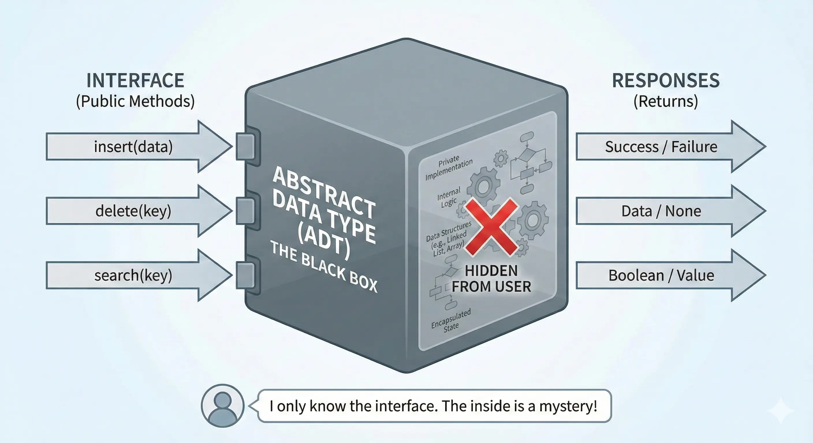

# Abstract Data Types (ADT)

An <b>Abstract Data Type (ADT)</b> is a logical model that describes <b>what</b> a data structure does, but not <b>how</b> it does it. Think of it as a "blueprint" or a contract: it defines the operations available to the user (like adding or removing elements) without revealing the complex internal code used to store the data.

  

## The "What" vs. The "How"

The most important distinction in software engineering is separating the interface from the implementation:

<ul>
  <li>
    <b>ADT (The "What"):</b> 
    Defines the logical model and the operations available (e.g., a "List" can <i>add</i>, <i>remove</i>, and <i>get</i> elements).
  </li>
  <li>
    <b>Data Structure (The "How"):</b> 
    The actual physical representation of the data in memory (e.g., implementing that "List" using a <i>Static Array</i> or a <i>Linked List</i>).
  </li>
</ul>

## Core Pillars

<table>
  <thead>
    <tr>
      <th>Concept</th>
      <th>Description</th>
    </tr>
  </thead>
  <tbody>
    <tr>
      <td><b>Abstraction</b></td>
      <td>Hiding the complex reality while exposing only the necessary parts.</td>
    </tr>
    <tr>
      <td><b>Encapsulation</b></td>
      <td>Bundling the data and the methods that operate on that data into a single unit.</td>
    </tr>
    <tr>
      <td><b>Information Hiding</b></td>
      <td>Preventing the user from accessing the internal state directly, forcing the use of the public interface.</td>
    </tr>
  </tbody>
</table>