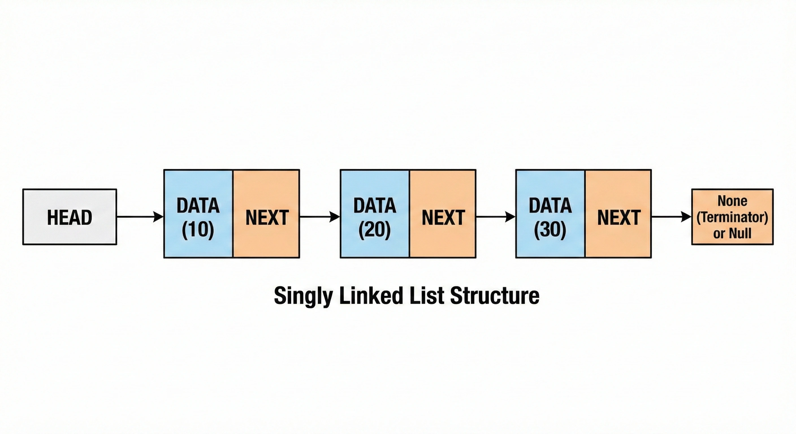

# Singly Linked Lists

A <b>singly linked list</b> is a dynamic data structure that consists of a sequence of nodes, where each node contains a value and a reference (or pointer) to the next node in the sequence. The last node has a reference to <code>None</code>, indicating the end of the list.

  

## Node: Fundamental Anatomy

To understand the list, we must first dissect its smallest component: the <b>Node</b>. In a *simple* (singly) list, each node acts like a train car that only knows who is behind it. It consists strictly of two parts:

<ul>
  <li><b>Data (Payload):</b> Is the real value we want to store (an integer, a string, a User object, etc.).</li>
  <li><b>Next (Pointer):</b> Is a memory address (reference) that points to the next node in the chain.</li>
</ul>

### Node Behavior

<ul>
  <li><b>Node Behavior:</b> A node <i>always looks forward</i>. It doesn't know what node is before it.</li>
  <li><b>Last Node:</b> The last node in the list has its <code>Next</code> pointer pointing to <code>None</code> (or <code>Null</code>). This indicates the end of the journey.</li>
</ul>

## General Structure

A singly linked list is a dynamic data structure that consists of a sequence of nodes, where each node contains a value and a reference (or pointer) to the next node in the sequence. The last node has a reference to <code>None</code>, indicating the end of the list.

  

### Characteristics

<ul>
  <li><b>Head:</b> The first node in the list. It contains the value of the first element.</li>
  <li><b>Tail:</b> The last node in the list. It contains the value of the last element and has a reference to <code>None</code>.</li>
  <li><b>Size:</b> The number of nodes in the list.</li>
</ul>

### Complexity

Comparative performance regarding Arrays:

<table>
  <thead>
    <tr>
      <th align="left">Operation</th>
      <th align="center">Linked List</th>
      <th align="center">Array</th>
      <th align="left">Explanation</th>
    </tr>
  </thead>
  <tbody>
    <tr>
      <td align="left"><b>Access</b> <code>get(i)</code></td>
      <td align="center">O(n)</td>
      <td align="center">O(1)</td>
      <td align="left">There are no indices in a list. You must traverse from the <code>head</code> skipping node by node.</td>
    </tr>
    <tr>
      <td align="left"><b>Insert at Beginning</b></td>
      <td align="center">O(1)</td>
      <td align="center">O(n)</td>
      <td align="left">In a list, it is instantaneous (change 1 pointer). In an Array, you must shift all elements to the right.</td>
    </tr>
    <tr>
      <td align="left"><b>Insert at End</b></td>
      <td align="center">O(n)</td>
      <td align="center">O(1)</td>
      <td align="left">You must traverse the entire list to reach the end (unless you have a <code>tail</code> pointer).</td>
    </tr>
    <tr>
      <td align="left"><b>Delete at Beginning</b></td>
      <td align="center">O(1)</td>
      <td align="center">O(n)</td>
      <td align="left">Simply move the <code>head</code> to the next node.</td>
    </tr>
  </tbody>
</table>

### When to use a Linked List?

<ul>
  <li>When you need to insert or delete elements constantly at the beginning of the collection.</li>
  <li>When you don't know how many elements you will have (dynamic real growth).</li>
  <li>When you don't need frequent random access (you don't need to do <code>list[500]</code>).</li>
</ul>