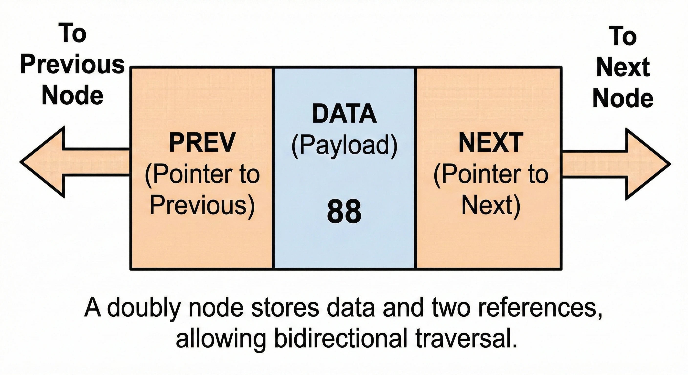
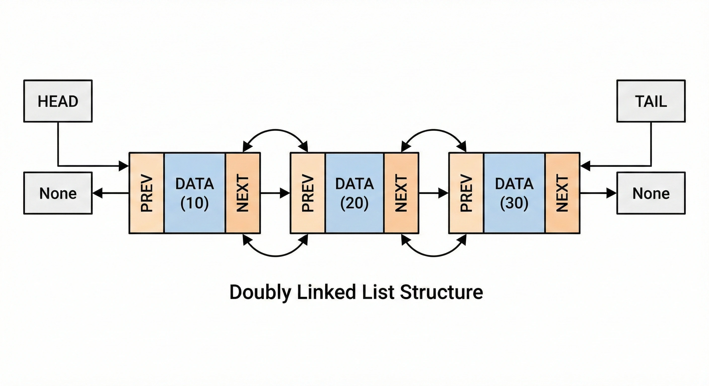

# Doubly Linked Lists

A <b>doubly linked list</b> is a more advanced version of a linked list where each node contains not only a reference to the <b>next</b> node but also a reference to the <b>previous</b> node. This bidirectional nature allows for more flexible traversal and operations.

  

 

## Node: Fundamental Anatomy

In a doubly linked list, the <b>Node</b> becomes slightly more complex but significantly more powerful. Each node acts like a train car that knows both who is behind it and who is in front of it. It consists of three parts:

<ul>
  <li><b>Data (Payload):</b> The value stored in the node.</li>
  <li><b>Next (Pointer):</b> A reference to the next node in the chain.</li>
  <li><b>Prev (Pointer):</b> A reference to the previous node in the chain.</li>
</ul>

### Node Behavior

<ul>
  <li><b>Bidirectional:</b> A node <i>looks both ways</i>. This allows us to traverse the list from head to tail or from tail to head.</li>
  <li><b>Boundaries:</b> The <code>Prev</code> pointer of the <b>Head</b> node and the <code>Next</code> pointer of the <b>Tail</b> node both point to <code>None</code>.</li>
</ul>

## General Structure

Structurally, a doubly linked list maintains a chain of these bidirectional nodes. Having access to both <code>Head</code> and <code>Tail</code> pointers makes many operations more efficient than in a singly linked list.

  

 

### Characteristics

<ul>
  <li><b>Head:</b> The starting point of the list. Its <code>prev</code> is always <code>None</code>.</li>
  <li><b>Tail:</b> The ending point of the list. Its <code>next</code> is always <code>None</code>.</li>
  <li><b>Bidirectional Traversal:</b> We can move forward using <code>next</code> and backward using <code>prev</code>.</li>
</ul>

## Memory Management

Like singly linked lists, doubly linked lists use <b>fragmented</b> memory. However, they require <b>more memory per node</b> because they must store two references (pointers) instead of one.

### Complexity

Comparative performance (assuming we have both <code>Head</code> and <code>Tail</code> pointers):

<table width="100%">
  <thead>
    <tr>
      <th align="left">Operation</th>
      <th align="center">Doubly Linked List</th>
      <th align="center">Singly Linked List</th>
      <th align="left">Explanation</th>
    </tr>
  </thead>
  <tbody>
    <tr>
      <td align="left"><b>Access</b> <code>get(i)</code></td>
      <td align="center">O(n)</td>
      <td align="center">O(n)</td>
      <td align="left">Still requires traversal. However, we can choose to start from the <code>Tail</code> if the index is closer to the end.</td>
    </tr>
    <tr>
      <td align="left"><b>Insert at Beginning</b></td>
      <td align="center">O(1)</td>
      <td align="center">O(1)</td>
      <td align="left">Just update <code>Head</code> and the new node's pointers.</td>
    </tr>
    <tr>
      <td align="left"><b>Insert at End</b></td>
      <td align="center">O(1)</td>
      <td align="center">O(1)*</td>
      <td align="left">Instantaneous if we have a <code>Tail</code> pointer.</td>
    </tr>
    <tr>
      <td align="left"><b>Delete at End</b></td>
      <td align="center"><b>O(1)</b></td>
      <td align="center">O(n)</td>
      <td align="left">In a doubly list, we can use <code>Tail.prev</code> to update the new tail instantly. In a singly list, we must traverse to find the node before the tail.</td>
    </tr>
    <tr>
      <td align="left"><b>Delete Given Node</b></td>
      <td align="center"><b>O(1)</b></td>
      <td align="center">O(n)</td>
      <td align="left">If you have a reference to the node, you can link its <code>prev</code> and <code>next</code> directly. In a singly list, you still need to find the previous node.</td>
    </tr>
  </tbody>
</table>

<small>*Singly linked lists need O(n) to insert at end if they don't maintain a tail pointer.</small>

### When to use a Doubly Linked List?

<ul>
  <li>When you need to navigate the collection in both directions (e.g., a "Back" and "Forward" button in a browser).</li>
  <li>When you need to delete nodes frequently and you already have references to them.</li>
  <li>When the extra memory overhead for the <code>prev</code> pointer is acceptable for the gained performance in deletions and reverse traversal.</li>
</ul>
