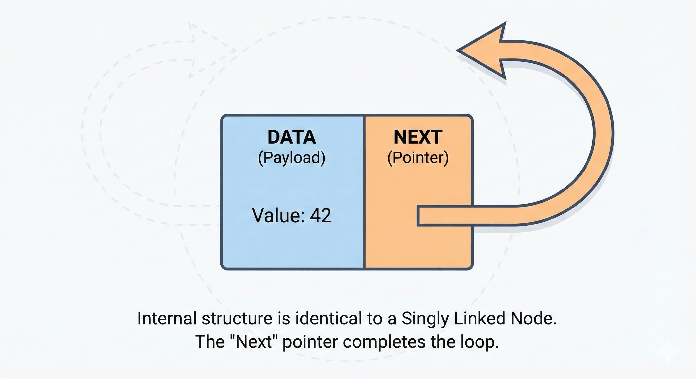
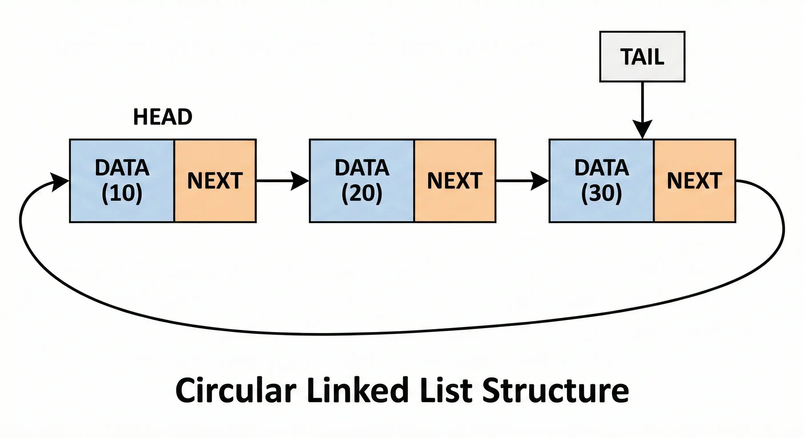

# Circular Linked Lists

A <b>circular linked list</b> is a variation of a linked list where the last node, instead of pointing to <code>None</code>, points back to the <b>first node</b> (the head). This creates a circular structure where you can traverse the list indefinitely without ever reaching a null reference.

  

## Node: Fundamental Anatomy

In a circular linked list, the <b>Node</b> itself is identical to a singly linked list node. The "circularity" is a property of how the nodes are connected, not the node's internal structure.

<ul>
  <li><b>Data (Payload):</b> The value stored in the node.</li>
  <li><b>Next (Pointer):</b> A reference to the next node in the sequence.</li>
</ul>

### Node Behavior

<ul>
  <li><b>Infinite Journey:</b> Unlike linear lists, you can start at any node and potentially visit every other node by just following the <code>next</code> pointers.</li>
  <li><b>No Terminal Node:</b> There is no node that points to <code>None</code>. Every node has a successor.</li>
</ul>

## General Structure

A circular linked list forms a continuous loop. In many implementations, we maintain a reference to the <b>Tail</b> (the last node) instead of the Head. Why? Because <code>tail.next</code> gives us the <b>Head</b> instantly, providing O(1) access to both ends of the list.

  

### Characteristics

<ul>
  <li><b>Looping:</b> The <code>next</code> pointer of the last node points back to the first node.</li>
  <li><b>Tail-Centric:</b> Often managed via a <code>tail</code> pointer for efficiency.</li>
  <li><b>Traversal Condition:</b> To avoid infinite loops, we usually stop when we reach the starting node again.</li>
</ul>

## Memory Management

Circular linked lists use <b>fragmented</b> memory, just like other linked structures. They don't require more memory than a singly linked list, but they require more careful logic to avoid infinite loops during traversal.

### Complexity

Comparative performance (assuming a <b>Tail</b> pointer is maintained):

<table width="100%">
  <thead>
    <tr>
      <th align="left">Operation</th>
      <th align="center">Circular List</th>
      <th align="center">Singly List</th>
      <th align="left">Explanation</th>
    </tr>
  </thead>
  <tbody>
    <tr>
      <td align="left"><b>Access</b> <code>get(i)</code></td>
      <td align="center">O(n)</td>
      <td align="center">O(n)</td>
      <td align="left">Requires linear traversal from the starting point.</td>
    </tr>
    <tr>
      <td align="left"><b>Insert at Beginning</b></td>
      <td align="center"><b>O(1)</b></td>
      <td align="center">O(1)</td>
      <td align="left">If we have a <code>tail</code> pointer, we just update <code>tail.next</code> and the new node's pointer.</td>
    </tr>
    <tr>
      <td align="left"><b>Insert at End</b></td>
      <td align="center"><b>O(1)</b></td>
      <td align="center">O(n)*</td>
      <td align="left">With a <code>tail</code> pointer, we can insert and update the tail reference instantly.</td>
    </tr>
    <tr>
      <td align="left"><b>Delete at Beginning</b></td>
      <td align="center">O(1)</td>
      <td align="center">O(1)</td>
      <td align="left">Update <code>tail.next</code> to point to <code>head.next</code>.</td>
    </tr>
  </tbody>
</table>

### When to use a Circular Linked List?

<ul>
  <li><b>Resource Scheduling:</b> Perfect for Round-Robin scheduling where multiple processes need equal CPU time in a cycle.</li>
  <li><b>Multiplayer Games:</b> Cycling through turns of players (Player 1 -> Player 2 -> Player 1).</li>
  <li><b>Buffer Management:</b> Implementing circular buffers (streaming data, undo/redo buffers).</li>
  <li><b>Continuous Playlists:</b> Media players that repeat a playlist indefinitely.</li>
</ul>
