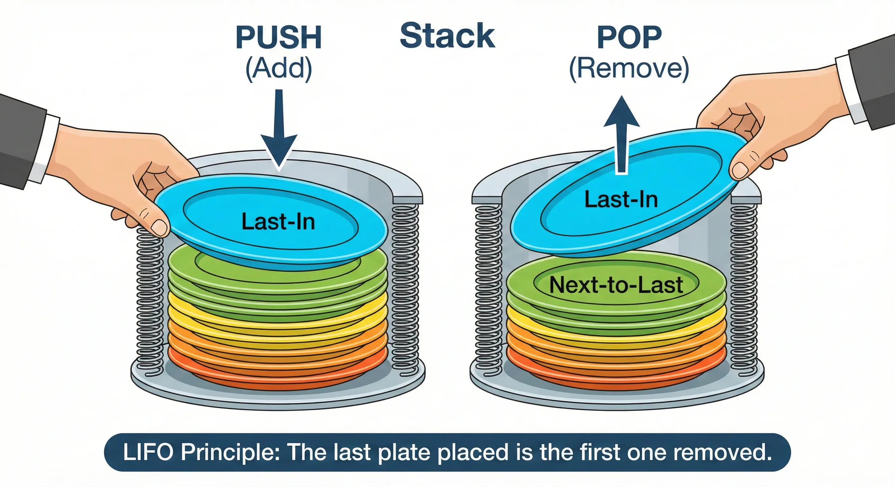

# Stacks (LIFO)

A <b>Stack</b> is a linear data structure that follows the <b>LIFO</b> (Last-In, First-Out) principle. This means that the last element added to the stack is the first one to be removed. Think of it like a stack of plates: you can only add a new plate to the top, and you can only remove the top plate.

  

 

## Core Operations

A Stack is defined by its two primary operations, which both happen at the "Top" of the stack:

<ul>
  <li><b>Push:</b> Adds an element to the top of the stack.</li>
  <li><b>Pop:</b> Removes and returns the element at the top of the stack.</li>
  <li><b>Peek (or Top):</b> Returns the top element without removing it.</li>
  <li><b>is_empty:</b> Checks if the stack has any elements.</li>
</ul>

### The LIFO Principle

<ul>
  <li><b>LIFO (Last-In, First-Out):</b> The element that has been in the stack the shortest amount of time is the first one out.</li>
  <li><b>Access:</b> Unlike arrays or linked lists, you cannot access elements in the middle of a stack without removing the ones on top of them.</li>
</ul>

## General Structure

This implementation uses a <b>Linked List</b> (Node-based) structure. This is the most efficient way to implement a stack because it guarantees <b>O(1)</b> time for all operations without the overhead of resizing an internal array.

### Complexity

<table>
  <thead>
    <tr>
      <th align="left">Operation</th>
      <th align="center">Complexity</th>
      <th align="left">Explanation</th>
    </tr>
  </thead>
  <tbody>
    <tr>
      <td align="left"><b>Push</b></td>
      <td align="center">O(1)</td>
      <td align="left">Creating a new node and pointing it to the current <code>top</code> is instantaneous.</td>
    </tr>
    <tr>
      <td align="left"><b>Pop</b></td>
      <td align="center">O(1)</td>
      <td align="left">Moving the <code>top</code> reference to the <code>next</code> node is instantaneous.</td>
    </tr>
    <tr>
      <td align="left"><b>Peek</b></td>
      <td align="center">O(1)</td>
      <td align="left">Just accessing the <code>data</code> attribute of the <code>top</code> node.</td>
    </tr>
    <tr>
      <td align="left"><b>Search</b></td>
      <td align="center">O(n)</td>
      <td align="left">In the worst case, you must traverse all nodes from <code>top</code> to the bottom.</td>
    </tr>
  </tbody>
</table>

### When to use a Stack?

<ul>
  <li><b>Function Calls:</b> The "Call Stack" in programming languages tracks which functions are currently running.</li>
  <li><b>Undo/Redo:</b> Storing the history of actions in a text editor.</li>
  <li><b>Expression Parsing:</b> Compilers use stacks to evaluate mathematical expressions (RPN) and check for balanced parentheses.</li>
  <li><b>Backtracking:</b> Navigating through a maze or searching through a graph (DFS).</li>
</ul>
