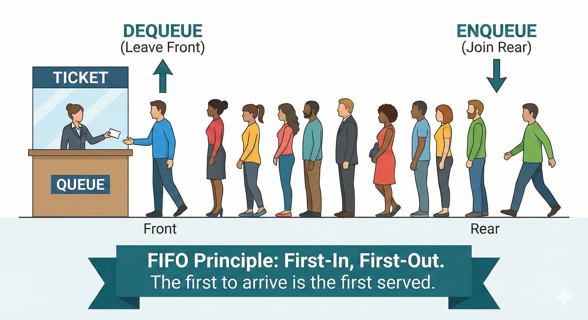

# Queues (FIFO)

A <b>Queue</b> is a linear data structure that follows the <b>FIFO</b> (First-In, First-Out) principle. This means that the first element added to the queue is the first one to be removed. Think of it like a line of people waiting for service: the person who joined the line first is served first.

  

 

## Core Operations

A Queue is defined by its two primary operations, which happen at opposite ends of the structure:

<ul>
  <li><b>Enqueue:</b> Adds an element to the <b>rear</b> (end) of the queue.</li>
  <li><b>Dequeue:</b> Removes and returns the element from the <b>front</b> (beginning) of the queue.</li>
  <li><b>Front:</b> Returns the element at the front without removing it.</li>
  <li><b>is_empty:</b> Checks if the queue has any elements.</li>
</ul>

### The FIFO Principle

<ul>
  <li><b>FIFO (First-In, First-Out):</b> The element that has been in the queue the longest amount of time is the first one out.</li>
  <li><b>Linear Access:</b> Access is restricted to the front for removal and the rear for insertion.</li>
</ul>

## General Structure

This implementation uses a <b>Linked List</b> (Node-based) with both <b>front</b> and <b>rear</b> pointers. This ensures that both <code>enqueue</code> and <code>dequeue</code> operations are highly efficient.

### Complexity

<table>
  <thead>
    <tr>
      <th align="left">Operation</th>
      <th align="center">Complexity</th>
      <th align="left">Explanation</th>
    </tr>
  </thead>
  <tbody>
    <tr>
      <td align="left"><b>Enqueue</b></td>
      <td align="center">O(1)</td>
      <td align="left">Adding to the <code>rear</code> using a pointer is instantaneous.</td>
    </tr>
    <tr>
      <td align="left"><b>Dequeue</b></td>
      <td align="center">O(1)</td>
      <td align="left">Removing from the <code>front</code> is instantaneous.</td>
    </tr>
    <tr>
      <td align="left"><b>Front</b></td>
      <td align="center">O(1)</td>
      <td align="left">Just accessing the <code>data</code> of the <code>front</code> node.</td>
    </tr>
    <tr>
      <td align="left"><b>Search</b></td>
      <td align="center">O(n)</td>
      <td align="left">In the worst case, you must traverse all nodes from <code>front</code> to <code>rear</code>.</td>
    </tr>
  </tbody>
</table>

### When to use a Queue?

<ul>
  <li><b>Process Scheduling:</b> Managing tasks in operating systems (Ready Queue).</li>
  <li><b>Data Buffers:</b> Handling asynchronous data transfers (IO Buffers, Pipes).</li>
  <li><b>Breadth-First Search (BFS):</b> Exploring nodes level-by-level in graphs or trees.</li>
  <li><b>Print Spooling:</b> Managing documents sent to a printer.</li>
  <li><b>Customer Service Systems:</b> Handling call center queues or ticketing systems.</li>
</ul>
