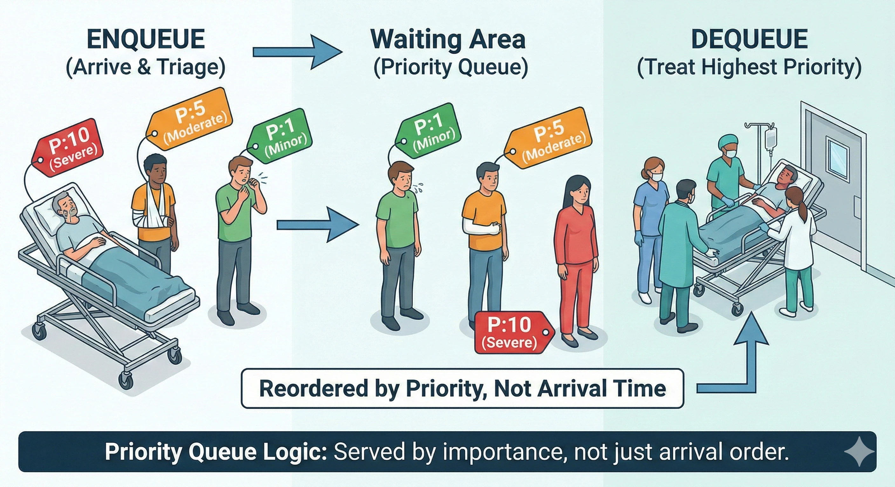

# Priority Queues

A <b>Priority Queue</b> is an abstract data type that is similar to a regular queue, but where each element has a "priority" associated with it. In a priority queue, an element with high priority is served before an element with low priority. 

Think of it like an <b>Emergency Room (ER) triage</b> in a hospital. Patients are not necessarily seen in the exact order they arrive (FIFO). A patient arriving with a life-threatening condition (high priority) will be treated before a patient who arrived earlier with a minor injury (low priority).

  

 

## Core Operations

Unlike a standard FIFO Queue, the operations here are focused on the "importance" of the elements:

<ul>
  <li><b>Insert (or Enqueue):</b> Adds an element to the queue with an associated priority value.</li>
  <li><b>Extract Max/Min (or Dequeue):</b> Removes and returns the element with the <b>highest priority</b>.</li>
  <li><b>Peek:</b> Returns the highest priority element without removing it.</li>
  <li><b>is_empty:</b> Checks if the queue has any elements.</li>
</ul>

### The Definition of "Priority"

<ul>
  <li><b>Max-Priority Queue:</b> The largest number represents the highest priority (e.g., urgency level 10 > level 1).</li>
  <li><b>Min-Priority Queue:</b> The smallest number represents the highest priority (e.g., 1st place > 5th place).</li>
</ul>

## General Structure

This implementation uses a <b>Sorted Linked List</b> (Node-based). When an element is enqueued, it is placed in its correct position according to its priority. This allows for extremely fast (O(1)) extraction of the highest priority element.

### Complexity

<table>
  <thead>
    <tr>
      <th align="left">Operation</th>
      <th align="center">Complexity</th>
      <th align="left">Explanation</th>
    </tr>
  </thead>
  <tbody>
    <tr>
      <td align="left"><b>Enqueue (Insert)</b></td>
      <td align="center">O(n)</td>
      <td align="left">In a sorted list, we must find the correct spot, which might require traversing the whole list.</td>
    </tr>
    <tr>
      <td align="left"><b>Dequeue (Extract)</b></td>
      <td align="center">O(1)</td>
      <td align="left">The highest priority element is always at the <code>front</code>.</td>
    </tr>
    <tr>
      <td align="left"><b>Peek</b></td>
      <td align="center">O(1)</td>
      <td align="left">Just accessing the <code>data</code> of the <code>front</code> node.</td>
    </tr>
  </tbody>
</table>

<small>Note: More advanced implementations use <b>Binary Heaps</b> to achieve O(log n) for both insertion and extraction.</small>

### When to use a Priority Queue?

<ul>
  <li><b>AI Pathfinding (A* Algorithm):</b> Deciding which nodes to explore next based on cost.</li>
  <li><b>OS Task Scheduling:</b> Running high-priority system tasks before background user tasks.</li>
  <li><b>Network Traffic:</b> Prioritizing voice/video packets over background file downloads.</li>
  <li><b>Huffman Coding:</b> Used in data compression algorithms.</li>
  <li><b>Event-Driven Simulations:</b> Processing events based on their scheduled timestamps.</li>
</ul>
