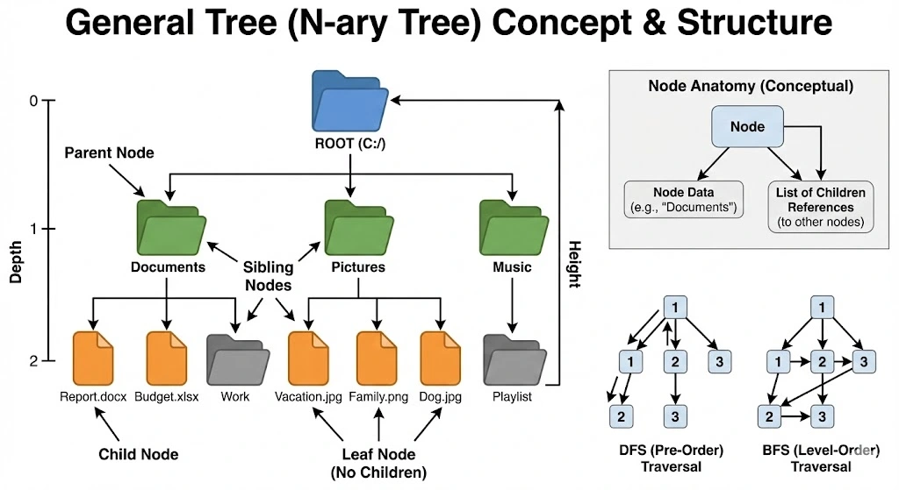

# General Trees

A <b>general tree</b> is a tree data structure in which each node has an unlimited number of children.

  

## Node: Fundamental Anatomy

In a general tree, the <b>Node</b> is the fundamental building block. Unlike linear structures, each node can point to multiple other nodes, creating a hierarchical structure. It consists of two main parts:

<ul>
  <li><b>Data (Payload):</b> The value stored in the node.</li>
  <li><b>Children (Pointers):</b> A collection (usually a list) of references to its child nodes.</li>
</ul>

### Node Behavior

<ul>
  <li><b>Unlimited Children:</b> A node can have any number of children (from zero to N).</li>
  <li><b>One Parent:</b> Except for the root, every node has exactly one parent.</li>
</ul>

## Key Terminology

<ul>
  <li><b>Root:</b> The top node of the tree.</li>
  <li><b>Parent:</b> The node that has child nodes.</li>
  <li><b>Child:</b> The node that is a child of a parent node.</li>
  <li><b>Sibling:</b> Nodes that have the same parent.</li>
  <li><b>Depth:</b> The distance from the root node to a given node.</li>
  <li><b>Leaf:</b> A node that has no children.</li>
  <li><b>Height:</b> The longest path from the root node to a leaf node.</li>
</ul>

## Core Operations & Traversal

Since trees are not linear, we can't just "iterate" from start to end. We have two main ways to explore them:

### Depth-First Search (DFS)

DFS explores as far as possible along each branch before backtracking.

<ul>
  <li><b>Preorder:</b> Visit the node first, then the left subtree, then the right subtree.</li>
  <li><b>Inorder:</b> Visit the left subtree first, then the node, then the right subtree.</li>
  <li><b>Postorder:</b> Visit the left subtree first, then the right subtree, then the node.</li>
</ul>

### Breadth-First Search (BFS)

BFS explores all nodes at the current depth level before moving on to the next level.

<ul>
  <li><b>Level Order:</b> Visit all nodes at the current depth level before moving on to the next level.</li>
</ul>

## Complexity

<table width="100%">
  <thead>
    <tr>
      <th align="left">Operation</th>
      <th align="center">Complexity</th>
      <th align="left">Explanation</th>
    </tr>
  </thead>
  <tbody>
    <tr>
      <td align="left"><b>Add Child</b></td>
      <td align="center">O(1)</td>
      <td align="left">Adding a new child node is instantaneous.</td>
    </tr>
    <tr>
      <td align="left"><b>Remove Node</b></td>
      <td align="center">O(n)</td>
      <td align="left">In the worst case, we must traverse the entire tree to find the node to remove.</td>
    </tr>
    <tr>
      <td align="left"><b>Search (DFS/BFS)</b></td>
      <td align="center">O(n)</td>
      <td align="left">In the worst case, we must traverse the entire tree to find the node (DFS/BFS).</td>
    </tr>
    <tr>
      <td align="left"><b>Height Calculation</b></td>
      <td align="center">O(n)</td>
      <td align="left">We must traverse the entire tree to find the height of the tree.</td>
    </tr>
  </tbody>
</table>

## When to use a General Tree?

<ul>
  <li><b>File Systems:</b> Directories containing files and subdirectories.</li>
  <li><b>DOM (Document Object Model):</b> HTML structure <code>&lt;body&gt;</code> contains <code>&lt;div&gt;</code>, which contains <code>&lt;p&gt;</code> and <code>&lt;img&gt;</code>, etc.</li>
  <li><b>Organizational Charts:</b> CEO -> VPs -> Managers -> Employees.</li>
  <li><b>Taxonomies:</b> Categorization of products in e-commerce or species in biology.</li>
</ul>
