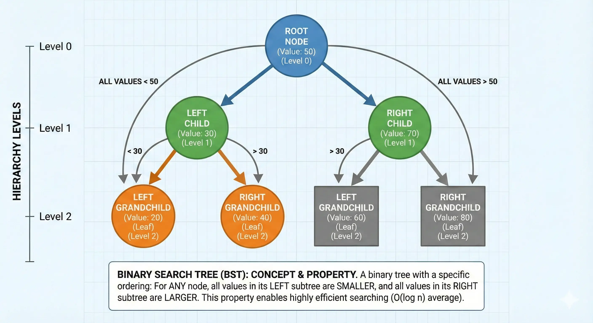

# Binary Search Trees (BST)

A <b>Binary Search Tree (BST)</b> is a binary tree with a strict ordering property. It is designed for efficient searching, insertion, and deletion.

  

## The BST Property

The core of a BST is the relationship between a parent and its children:

<ul>
  <li><b>Left Rule:</b> All nodes in the left subtree have values <b>smaller</b> than the root.</li>
  <li><b>Right Rule:</b> All nodes in the right subtree have values <b>greater</b> than the root.</li>
  <li><b>Recursive:</b> This rule applies to every single node within the tree, not just the root.</li>
</ul>

## Binary Search Tree vs. Binary Tree

| Feature               |       Binary Tree        |      Binary Search Tree      |
| :-------------------- | :----------------------: | :--------------------------: |
| **Ordering**          | None (Hierarchical only) | Strict (Left < Node < Right) |
| **Search Complexity** |           O(n)           |   O(log n) \*Average Case    |
| **Purpose**           |    General hierarchy     | Efficient lookup and sorting |
| **Inorder Traversal** |       Random order       |   Sorted (Ascending) order   |

## Core Operations

BSTs excel at operations where you can "discard" half of the tree at each step:

<ul>
  <li><b>Search:</b> Compare with root; go left if smaller, right if larger.</li>
  <li><b>Insert:</b> Follow the search path until you find an empty spot (None).</li>
  <li><b>Delete:</b> More complex; requires handling nodes with 0, 1, or 2 children (successor/predecessor).</li>
</ul>

## Complexity

| Operation     | Average  | Worst Case (Skewed) |
| :------------ | :------: | :-----------------: |
| **Search**    | O(log n) |        O(n)         |
| **Insertion** | O(log n) |        O(n)         |
| **Deletion**  | O(log n) |        O(n)         |

<i>Note: The worst case occurs when the tree becomes "unbalanced" (like a linked list). This is why balanced trees like AVL or Red-Black trees are used.</i>

## Why use a BST?

<ul>
  <li><b>Dynamic Sets:</b> When you need to maintain a sorted list while frequently adding/removing elements.</li>
  <li><b>Symbol Tables:</b> Used in compilers and database indexing.</li>
  <li><b>Priority Queues:</b> When using specific types of BSTs.</li>
</ul>
